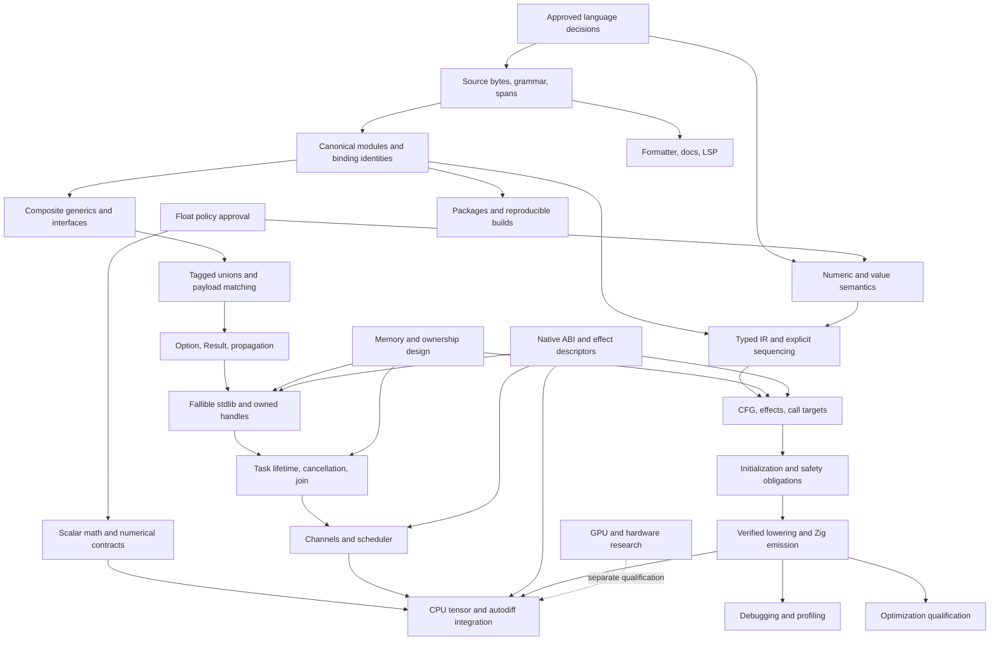

> **Source:** Codex CLI external reviewer, full language and compiler feature research.  
> **Session:** `codex rollout 2026-09-14T23-12-26 (01a0a18c-ae30)`  
> **Date:** 2026-09-14. Recovered 2026-09-15 from temporary output after Plan Mode blocked the original write.  
> **Status:** Advisory. Body preserved verbatim except removal of pre-report narration where noted. User decisions are in the [ledger](../decisions.md).

**A7 full v1 language and compiler research, 2026-09-14.**

Advisory, read-only research for the controlling Codex session. No repository files were changed, no implementation was attempted, and no external model or agent CLI was launched. Three built-in specialists independently reviewed frontend/tooling, types/functions, and concurrency/stdlib.

A7’s full v1 needs a coherent language contract and a compiler representation that preserves that contract through transformations. Adding syntax to the current pipeline would leave known inconsistencies in name identity, proof invalidation, constant evaluation, module handling, and backend behavior.

The recommended implementation foundation is a typed, explicitly sequenced intermediate representation with a control-flow graph, stable declaration identities, effect summaries, exact constant evaluation, and checked transformation boundaries. Ownership, concurrency, fuller libraries, and CPU AI remain within the requested broad v1. Their inclusion does not imply that every proposed syntax or behavior is approved.

---

**The research baseline is identifiable, but it is not a release qualification.**

| Item | Inspected state |
|---|---|
| Repository | `/home/cx89/Projects/pl-dev/a7-py` |
| Commit | `701c67936c70ad2b0608326e23e56cc5d38c9fdb` |
| Compiler package | `0.3.0`, from `pyproject.toml` |
| Python requirement | `>=3.13` |
| Available project Python | `3.13.15` |
| Documented Zig backend | `0.16.0` |
| Working tree | Existing modified documentation and `AGENTS.md`; untracked audit documents and pipeline regression tests |
| Fresh validation in this run | Selective source inspection and in-memory probes |
| Not performed | Full release gate, native execution campaign, fuzzing campaign, platform qualification, security review |

The review read [README.md](/home/cx89/Projects/pl-dev/a7-py/README.md), [SPEC.md](/home/cx89/Projects/pl-dev/a7-py/docs/SPEC.md), [SAFETY_CONTRACT.md](/home/cx89/Projects/pl-dev/a7-py/docs/SAFETY_CONTRACT.md), and [08-decisions.md](/home/cx89/Projects/pl-dev/a7-py/docs/lang-safety/08-decisions.md). It also inspected relevant compiler, pipeline, language-contract, test-quality, and coordinator audits under [the dated audit directory](/home/cx89/Projects/pl-dev/a7-py/docs/audits/2026-09-14/README.md).

Existing audit execution results are attributed to those audits. They were not silently converted into fresh results.

---

**Current user directions override the historical decision register.**

| Subject | Authority for this plan | Consequence |
|---|---|---|
| Integers | Explicit-width primitives; `usize` for indices and sizes | Remove planned public arbitrary-precision `int`, `uint`, and `number` from the active design |
| Ordinary integer arithmetic | Defined wrapping `+`, `-`, `*` | Implement modular arithmetic consistently in constants, scalar expressions, compound assignments, and array operations |
| Scalar floats | `f32`, `f64` | No additional ordinary scalar float vocabulary assumed |
| AI tensor dtypes | `f16`, `bf16`, `f32`, `f64` | Tensor storage and numerical contracts belong to the AI report |
| Float behavior | IEEE versus finite-only remains unapproved | Do not infer behavior from current SPEC wording or Zig defaults |
| Arguments | Bindings immutable; explicitly permitted referent mutation approved | Separate binding reassignment from writes to referenced storage |
| Parameter modes | Syntax unapproved | Do not introduce `borrow`, `inout`, or `consume` as accepted syntax |
| Recursion | Source recursion banned | Preserve rejection through imports, specialization, callbacks, and future function-value forms |
| References | No public address-of/dereference operators | Internal IR operations do not justify public syntax |
| Full v1 | Ownership, concurrency, fuller stdlib, CPU training/inference | Earlier documents deferring these domains do not define current scope |
| GPU/hardware | Separate research | Does not enlarge CPU v1 qualification |
| Language changes | Concrete before/after examples, compatibility analysis, user approval | Research recommendations remain proposals |

The historical register contains additional conflicts that require individual disposition:

- D.001–D.004 rely on the superseded arbitrary-precision numeric model.
- D.007 uses `uint` lengths and a UTF-8 string model that conflicts with the current ASCII specification.
- D.024 retains `cast()`, while D.038 removes it. The register itself acknowledges this contradiction.
- D.013 retains `nil`, while an older cluster summary still says it is removed.
- D.022 permits checked operation alternatives, while later conversion summaries constrain some fallible alternatives.
- D.040 mixes binding immutability with mode-dependent permissions. That must be reconciled with the current instruction that argument bindings remain immutable.
- D.053 claims exact task-stack sizing from the recursion ban. That claim is not established.
- The safety contract requires arithmetic range proofs, while current direction makes ordinary integer addition, subtraction, and multiplication wrap.
- Current I/O helpers panic on external failures, despite broad no-trap contract wording.

Reconciliation must preserve the original records and mark their replacements. Mechanical replacement of `int` with `i32` would retain invalid assumptions about range, conversion, allocation, and arithmetic.

---

**The feature inventory comes before recommendations.**

“Current” means present in inspected source or documented current behavior. It does not mean all interactions have passed native qualification. “Missing” means a complete contract or implementation was not established in this review.

| Feature group | Current implementation or documentation | Planned, conflicted, or missing |
|---|---|---|
| Source encoding | SPEC says ASCII; loaders decode UTF-8 | Source bytes and text-value encoding disagree |
| Unicode | Raw Unicode strings accepted by scanner | Identifier, numeric, character, normalization, and control-code policies incomplete |
| Whitespace | Spaces/CR accepted, LF terminators, tabs rejected | CR-only files, BOM handling, multiline contexts, and location units need one contract |
| Comments | `//`, nested block comments, scanner also accepts `#` comments | Hash comments undocumented; unterminated block comments consume EOF |
| Identifiers | ASCII ordinary names and length limit | Leading underscore rules conflict; `$`/`@` names use broader Unicode predicates |
| Keywords | Keyword table and parser forms exist | Implemented, reserved, parser-only, and proposed spellings are not consistently separated |
| Integer literals | Decimal, binary, octal, hex, separators | Malformed radix tails, separator placement, contextual fitting, and Unicode digits inconsistent |
| Float literals | Decimal/exponent forms | Exact parsing, out-of-range values, rounding, and finite-only versus IEEE behavior unsettled |
| Character/string escapes | Validation exists | ASCII limits, byte escapes, raw newlines, Unicode scalar escapes, and resulting text validity conflict |
| Interpolation | Historical `f"..."` proposal | No dedicated current scanner/parser implementation; formatting and allocation behavior unresolved |
| Tokenizer state | Handwritten scanner | All malformed paths need progress and source-span guarantees |
| Grammar | Recursive descent and precedence climbing | Summary grammar includes unsupported or obsolete forms |
| Precedence/associativity | Established binary precedence; left-associative parsing | Chained comparisons, assignment expressions, ranges, and future syntax need precise disposition |
| Parser recovery | Top-level recovery exists | Errors can be discarded; malformed declarations can disappear; statement-match loop can fail to progress |
| Parser complexity | Arbitrary declaration/recovery caps; recursive paths | Published minimum limits unqualified; complexity diagnostics incomplete |
| Declarations | Constants, mutable locals, functions, types, aliases | Typed-binding mutability prose contradicts itself |
| Scopes/shadowing | Lexical symbol tables | Stable identity absent from several analyses; loop and nested-function behavior inconsistent |
| Modules | File modules, virtual stdlib modules, limited file imports | Canonical identity, exported types, visibility, initialization, and broader import forms incomplete |
| Import cycles | Loader and topological sorter have different behavior | Public cycle policy unresolved independently of function recursion |
| Separate compilation | Current modules combine into one Zig file | Interface format, invalidation, linking, and generic-body distribution missing |
| Integer primitives | `i8/i16/i32/i64`, unsigned equivalents, `isize/usize` | Target-dependent widths partly hard-coded as 64-bit |
| Floats and bool | `f32/f64`, distinct bool | Float domain unsettled; retain no implicit truthiness |
| `char` and `string` | ASCII-oriented SPEC; string slices described as `[]char` | UTF-8 proposal, byte/code-point indexing, ownership, and equality require reconciliation |
| Fixed arrays | Nested types, zero/scalar/list initialization, same-shape numeric `+` | Inferred-array lowering and complete initialization qualification incomplete |
| Slices | `[]T`, `.len`, array-to-slice behavior | Mutation, lifetime, equality, and ownership depend on memory decisions |
| References | Nullable `ref T`, `nil`, implicit typed reference passing | Non-null/optional split and affine ownership planned |
| Structs | Named/inline structs; positional/named initializers | Completeness, defaults, nominal identity, equality, and ABI rules incomplete |
| Enums | Scalar variants and explicit discriminants | Base type, duplicate values, foreign invalid values, and extension policy incomplete |
| Untagged unions | Single-field construction and field access | Active-member safety incomplete |
| Tagged unions | Planned syntax/design material | Foundation for safe payload matching and error types remains incomplete |
| Options/results | Historical accepted proposals | No complete current implementation; spelling and propagation conflicts remain |
| Aliases/newtypes | Aliases implemented | Transparent alias versus distinct nominal type must be explicit; newtypes not assumed |
| Equality/order | Broad comparability checks | Per-type operator legality exceeds established backend support |
| Evaluation order | SPEC promises left-to-right operands/arguments and declaration-order field initialization | Assignment and compound-assignment sequencing underspecified; lowering must enforce order |
| Conversions | `cast()` classifier and range checks | Implicit widening conflicts with SPEC; narrowing and fallible forms need reconciliation |
| Integer division/remainder | `@divTrunc`/`@rem` lowering and nonzero proof | Signed minimum divided by `-1` needs explicit policy |
| Shifts | Parsed and lowered | Count types/range, oversized shifts, signed shifts, and proof obligations incomplete |
| Overflow | Arithmetic proof function disabled; ordinary Zig operators emitted | Does not yet implement approved wrapping behavior |
| Conditionals | Statements and expressions | Branch joins and return/divergence reasoning incomplete |
| Matching | Literals, ranges, captures, wildcard, bool/enum checks, restricted `fall` | Payload patterns, guards, and name-dependent capture semantics need design |
| Loops/jumps | While, infinite/C-style/iteration loops, labels, break/continue | Loop invariants, wrapping induction, cleanup edges, and exit reasoning incomplete |
| `defer` | Scope-exit cleanup and LIFO intent | Capture timing, mutation, failure, auto-drop, and suspension interactions unresolved |
| Unreachable | Static diagnostics; proposed intrinsic | Runtime unchecked `unreachable` is not justified by its spelling |
| Functions | Named functions, value-parameter immutability, `ref` writes | Effects, nested functions, public contracts, and default/named arguments need disposition |
| Methods | Explicit receiver functions | Method-call sugar planned; lookup and evaluation semantics unapproved |
| Function pointers/callbacks | Function types, aliases, selected trampoline analysis | All storage/return/import/native forms not qualified |
| Closures | No complete capture contract established | Captures, escape, layout, invocation multiplicity, and recursion analysis missing |
| Variadics | Parsed/partly checked; rejected before backend execution | Homogeneous packs, formatting arguments, and C varargs are separate unfinished features |
| Multiple returns | Struct returns available | Tuple/destructuring/multiple-return syntax planned |
| Generics | `$T`, type sets, inference, limited specialization | Composite substitution, identity, error reporting, and cross-module behavior incomplete |
| Constraints | Closed type sets | Equality/hash/clone/effect capabilities not established by set membership alone |
| Comptime/reflection | `@type_set` usable; other intrinsics largely reserved | Determinism, supported evaluation, reflection permissions, and budgets missing |
| Concurrency | Historical task/channel proposals | Runtime and complete task/channel/error contracts missing |
| Task lifetime/cancellation | No qualified current facility | Scope ownership, joining, cancellation races, and shutdown missing |
| Stdlib | Registered `io` and `math` | String/memory files are unregistered stubs; collections and broader libraries missing |
| Native interface | Compiler-owned Zig mappings | General ABI, ownership, callback, error, and blocking descriptors missing |
| CLI | File-based invocation and modes; human/JSON output | `check/build/run/test/fmt/doctor` and public API docs need design |
| Packages | Python distribution and wheel workflow | A7 package manifest, dependency lock, language version, offline builds, and interface versioning missing |
| Editor/debug/profiling | AST/JSON foundation | Shared editor frontend, source mapping, native attribution, and debugger workflows incomplete |
| CPU AI | Broad v1 requirement | Dedicated AI report owns tensor/autodiff and numerical-kernel qualification |
| GPU/hardware | Planned research material | Separate scope and acceptance |

No completion percentage follows from this inventory. Every row needs an accepted disposition and appropriate evidence, including deliberate exclusions.

---

**Several defects directly constrain the compiler plan.**

| Evidence | Finding | Planning consequence |
|---|---|---|
| `a7/safety.py:149` onward | Facts keyed by names; backend approvals keyed by Python object identity | Introduce stable binding and operation identities |
| `a7/safety.py:301` onward | Scope/branch restoration loses writes; compound assignment records RHS facts; calls do not invalidate affected state | Use CFG dataflow and explicit call effects |
| `a7/ast_preprocessor.py:620` | Integer division folding passes through Python floating point | Exact integer evaluator is required |
| `a7/ast_preprocessor.py:114` | Folding replaces AST nodes after safety analysis | Rewritten operations need current types and valid proofs |
| `a7/types.py:107` onward | Numeric assignment widening and pointer-sized ranks conflict with SPEC | Centralize target-aware numeric rules |
| `a7/passes/type_checker.py:1193` onward | Mixed integer arithmetic can return the left operand’s type | Operand order must not accidentally choose numeric type |
| `a7/passes/type_checker.py:2721` onward | Struct initializer validation incomplete | Reject undefined types and invalid field sets before Zig |
| `a7/passes/semantic_validator.py:501` onward | Name-based call graph; cycle search explores paths repeatedly | Stable function identities and iterative SCC analysis |
| `a7/module_resolver.py:123` onward | Raw-spelling cache and loading-state ordering undermine identity/cycle checks | Canonical module records with explicit loading states |
| `a7/compile.py` | Semantic mode and codegen modes assemble modules differently | One semantic program across command modes |
| `a7/backends/zig.py:1505` onward | Partial Zig identifier escaping | One binding-to-emitted-name mechanism for every context |
| `a7/compile.py` | Imported diagnostic origins and artifact provenance can be wrong | Source manager and invocation-owned artifact records |

A fresh node-local probe in this run produced:

```text
Input constant expression: 9007199254740993 / 1
Required exact quotient:   9007199254740993
Actual folded literal:     9007199254740992
Replacement node created:  yes
Replacement in type map:   no
```

This probe did not execute a native program. The existing coordinator audit separately records full-pipeline/native reproduction.

The frontend specialist also confirmed in memory that the scanner accepts Unicode text, Unicode numeric digits, `$Δ`, repeated numeric separators, hash comments, raw newlines inside strings, and an unclosed block comment. These observations establish scanner behavior only.

A parser probe retained declarations `a`, `b`, and `c` without raising an error:

```a7
a :: 1
b :: 2
broken :: fn( {
c :: 3
```

The preserved audit reports additionally record parser nontermination, silent declaration loss, stale proof facts, invalid Zig output, imported source errors becoming internal failures, and output-path collisions. Their proposed fixes are advisory. For example, an older recommendation to re-enable overflow rejection must be replaced by the newly approved wrapping semantics.

---

**Primary-language comparisons support specific choices, not wholesale adoption.**

| Feature | Odin | Zig | Rust | Go | Swift | C++ |
|---|---|---|---|---|---|---|
| Integer overflow | Defined behavior useful for A7’s wrapping direction | Distinct wrapping operators | Explicit wrapping APIs; casts have their own rules | Defined integer overflow | Separate overflow operators | Ordinary signed overflow is not A7’s model |
| Source/name policy | Simpler identifier model | Defined UTF-8 source policy | Identifier NFC normalization | UTF-8 source without canonicalizing code points | Broad identifier repertoire | Draft requires NFC identifiers |
| Generic programming | Explicit/inferred compile-time polymorphism | Comptime-based programming | Constraints and restricted const evaluation | Explicit generic constraints | Generic constraints | Templates plus constraint satisfaction |
| Parameter behavior | Immutable parameters | Immutable parameters | Binding/reference permissions distinct | Value passing and reference-like values | Immutable parameters with explicit mutation contracts | Several distinct value/reference conventions |
| Composite layout | Explicit foreign facilities | Backend-specific layout controls | Default and C representations distinct | Language-level struct rules | Language and interop concerns distinct | ABI/layout depends on type category and target |
| Matching/errors | Useful sum-type precedent | Tagged unions and error facilities | Payload matching and guard/move rules | Switch/type-switch and explicit error values | Enum payloads and structured control | Variant/exception/library choices |
| Concurrency | Requires its own runtime/library choices | Version-specific facilities need qualification | Scoped threads and bounded channels | Goroutines/channels; cancellation separate from completion | Structured tasks and cooperative cancellation | Join handles and stop requests |
| Modules/native boundary | Directory packages, public defaults, explicit foreign declarations | Imports and comptime/module facilities | Crates/modules and explicit native representation | Import-cycle prohibition and module tooling | Modules plus interoperability | Translation units/modules and native ABI complexity |

These are comparisons, not claims that each language provides A7’s intended safety contract. Primary references include the [Odin overview](https://odin-lang.org/docs/overview/), [Zig 0.16.0 reference](https://ziglang.org/documentation/0.16.0/), [Go specification](https://go.dev/ref/spec), [Rust operator rules](https://doc.rust-lang.org/reference/expressions/operator-expr.html), [Swift function documentation source](https://raw.githubusercontent.com/swiftlang/swift-book/main/TSPL.docc/LanguageGuide/Functions.md), and [C++ expression working draft](https://eel.is/c++draft/expr.pre).

Research languages contribute narrower lessons:

- Futhark documents restrictions on higher-order values to support defunctionalization, size-dependent array typing, and fixed-point alias reasoning around loops. A7 should similarly state restrictions where its analysis depends on them. It should not advertise unrestricted closures and later reject arbitrary cases. [Futhark 0.27.0 language reference](https://futhark.readthedocs.io/en/stable/language-reference.html).
- Koka connects effects to semantic properties rather than treating them as descriptive labels. A7 can adopt internal effect summaries without adopting Koka’s public effect syntax. [Koka effect-types research](https://www.microsoft.com/en-us/research/publication/koka-programming-with-row-polymorphic-effect-types/).
- Pony’s isolation model concerns reachable references. Moving an outer struct does not by itself establish safe cross-task transfer. [Pony reference capabilities](https://tutorial.ponylang.io/reference-capabilities/reference-capabilities.html).

No unverified Jai feature claim is used.

---

**Proposed package A defines source text and parsing without replacing the parser unnecessarily.**

Recommended policy, pending approval:

- UTF-8 source files.
- ASCII ordinary, generic, and builtin names.
- ASCII numeric digits.
- Unicode text in comments and strings.
- Explicit handling of BOM, line endings, forbidden control characters, and invalid UTF-8.
- Original source bytes retained separately from decoded literal values.
- Byte spans as the internal location authority, with deliberate conversion for human columns and editor protocols.

Unicode identifiers remain an alternative. If selected, pin a Unicode version and choose normalization behavior explicitly. Rust normalization, C++’s normalization requirement, and Go’s code-point distinction produce different accepted programs. [Rust identifiers](https://doc.rust-lang.org/reference/identifiers.html), [C++ identifier draft](https://eel.is/c++draft/lex.name), [Go specification](https://go.dev/ref/spec).

The scanner should have explicit states for ordinary code, line comments, nested block comments, strings, characters, and proposed interpolation. Each transition must consume input, finish a token, or report an error. Numeric token spelling must be validated as a whole so `0b12` does not become unrelated valid tokens.

Retain comments and whitespace as trivia or a concrete syntax representation for formatting and documentation. The semantic AST can remain smaller.

Keep recursive descent and precedence climbing unless measurements justify replacement. Fix context handling for struct literals rather than relying on a ten-token backward scan.

Parser recovery must preserve diagnostics. A partial syntax tree can support an editor, but any parse error prevents executable artifact generation. Progress checks and documented complexity diagnostics should replace arbitrary success-like truncation.

Go’s parser source provides a useful implementation comparison for synchronization, bad nodes, and error collection. It does not define A7’s grammar. [Go parser implementation](https://go.dev/src/go/parser/parser.go).

**Proposed before/after examples for package A.**

```a7
// Before: accepted by the scanner, contrary to ASCII documentation.
message: string = "مرحبا"

// Proposed after: documented UTF-8 text support.
message: string = "مرحبا"
```

```a7
// Before: scanner accepts these numeric digits.
count: u32 = ١٢

// Proposed after: diagnose that spelling; corrected source:
count: u32 = 12
```

```a7
// Before: scanner consumes the unclosed comment through EOF.
value: u32 = 1 /* explanation

// Proposed after: report an unclosed-comment diagnostic.
// Corrected source:
value: u32 = 1 /* explanation */
```

```a7
// Before: malformed declaration may disappear.
a :: 1
broken :: fn( {
c :: 3

// Proposed after: same bytes produce a parse failure.
// Editor analysis may retain c; compilation cannot succeed.
```

Compatibility impact: Unicode text becomes explicitly supported; accidental Unicode names/digits and permissive malformed literals may become rejected. Hash-comment support, leading underscores, same-line separators, multiline ordinary strings, and newline placement before function bodies need individual approval examples before implementation.

For interpolation:

```a7
// Current formatting call:
io.println("name: {}", name)

// Proposed expression syntax, not current runnable A7:
message: string = f"name: {name}"
```

Approval must cover expression evaluation exactly once and left-to-right, brace escaping, format syntax, nested expressions, allocation failure, result ownership, and compile-time/runtime formatting parity. If allocation can fail, the illustrated direct `string` result cannot be assumed without an allocation policy.

---

**Proposed package B makes numeric and value semantics consistent.**

Use one target-parameterized numeric specification shared by type checking, constant evaluation, proof analysis, and lowering.

For ordinary typed integer `+`, `-`, and `*`, the result is the mathematical result modulo \(2^N\), interpreted according to the signedness of the result type. Corresponding compound assignments must agree. This implements current user direction.

For Zig lowering, select its wrapping operations deliberately. Ordinary Zig operators are not a substitute for that decision. [Zig wrapping arithmetic](https://ziglang.org/documentation/0.16.0/#Wrapping-Operations).

A compiler may use arbitrary-precision integers internally to parse literals and calculate exact results. That does not introduce public bignum primitives.

The following decisions remain necessary:

| Decision | Recommended proposal | Alternative or unresolved detail |
|---|---|---|
| Mixed numeric operands | Require the same concrete type, with contextual literals | Permit a precisely defined lossless widening rule |
| Default integer literals | Retain a documented default after contextual typing | Wider default or explicit annotation requirements |
| Constant-expression typing | Apply the same typed operation semantics as runtime | Exact untyped expressions need a separately specified boundary |
| Unary negation | Wrapping negation for integer consistency | Require proof for signed minimum |
| Integer division | Truncate toward zero | Other rounding would be a compatibility change |
| Remainder | Dividend-sign remainder consistent with truncating division | Euclidean modulo should have a separate operation |
| Signed `MIN / -1` | Define explicitly | Wrapping quotient or proof-required/fallible operation |
| Signed `MIN % -1` | Define explicitly, including backend handling | Do not assume nonzero divisor is sufficient |
| Shift counts | Require a count below bit width | Total oversized-shift behavior or masked counts |
| Narrowing casts | Preserve proof-required exact conversion | Separate fallible/truncating API if approved |
| Integer-to-float conversion | Define precision loss explicitly | Exact-only proof or explicit rounded conversion |
| Pointer-sized integers | Derive from target layout | Never infer target width from Python host |
| Allocation arithmetic | Checked size/capacity operations | Ordinary wrapping cannot justify allocation sizes |

Contextual constant typing needs a concrete approval test:

```a7
a: u8 = 250 + 10
b: u8 = 300 - 100
```

If operands are contextually typed as `u8`, `a` wraps and `300` is invalid. If the expressions remain exact untyped constants until assignment, `a` is out of range and `b` fits. Either policy can be specified; silently mixing them across contexts is unacceptable. Prefer a rule that clearly distinguishes exact literal elaboration from operations on already typed values.

**Proposed before/after examples for package B.**

```a7
// Before: lowering uses ordinary Zig arithmetic.
x: u8 = 255
x += 1

// After implementation of the approved direction:
// Identical A7 source must leave x equal to 0 in every profile.
```

```a7
// Before: accepted mixed operands can receive inconsistent result types.
small: i8 = 1
large: i32 = 2
sum := small + large

// Proposed after, same-type arithmetic policy:
sum := cast(i32, small) + large
```

```a7
x: i8 = -128
q := x / -1
r := x % -1
```

Before: nonzero proof alone does not establish legal backend execution.

Proposed alternatives:

- Defined wrapping quotient: `q` is `-128`, `r` is `0`, with explicit safe lowering.
- Proof-required division: reject the exceptional pair and provide an approved fallible operation for dynamic inputs.

This choice is not settled by the approved wrapping behavior of binary `+`, `-`, and `*`.

```a7
value: u8 = 1
count: usize = 8
shifted := value << count
```

Proposed alternatives must state whether this is rejected, produces a total specified result, or masks the count. The backend must not choose accidentally.

Compatibility impact: mixed-width source may require explicit casts; arithmetic previously rejected or trapping becomes defined where wrapping is approved; constants and runtime expressions must stop disagreeing.

---

**Float policy remains an approval gate.**

The current specification’s IEEE labels do not override the explicit instruction that IEEE versus finite-only behavior is undecided.

| Concern | IEEE-oriented package | Finite-only package |
|---|---|---|
| Value domain | Includes infinities, NaNs, signed zero, subnormals under a defined contract | Ordinary values exclude non-finite results |
| Arithmetic overflow/domain errors | Defined floating results where specified | Proof, checked result, or another explicit failure mechanism |
| Parsing | Rules for overflow and special values | Reject or return failure for non-finite results |
| Equality/order | NaN and signed-zero behavior must be explicit | Still needs signed-zero and rounding decisions |
| Bit conversion | All supported bit patterns need a policy | Invalid/non-finite patterns require validation |
| Native kernels | May return non-finite values | Adapters must check results or rely on qualified stronger contracts |
| Optimization | No reassociation/contraction unless permitted | Finite inputs alone do not justify reassociation or all fast-math assumptions |

Required examples include:

```a7
large: f32 = 3.0e38
result := large * 2.0
```

```a7
zero: f64 = 0.0
result := zero / zero
```

```a7
result := math.sqrt(-1.0)
```

For each, the proposal must show the current observation, the selected result or diagnostic, and the corresponding fallible alternative if one exists.

Also decide literal rounding, intermediate precision, subnormal handling, signed zero, NaN payload observability, fused multiply-add, and reproducibility expectations. Scalar policy and tensor policy may differ only through an explicit boundary.

Do not enable fast-math merely because a program passed tests or all observed inputs were finite.

---

**Proposed package C establishes composite values, matching, and errors together.**

Named structs, enums, and tagged unions should have declaration-based nominal identity. Transparent aliases retain that identity. Anonymous structural types need a separate equivalence rule.

Initialization must validate the complete type:

- Every required field exists exactly once.
- Unknown and duplicate fields are rejected.
- Positional/named mixing has one rule.
- Declared defaults, if approved, are evaluated in a specified order.
- Zero initialization applies only where zero is a valid language value.
- Non-null references, resources, and tagged unions cannot become valid merely because their storage was zeroed.
- Enum conversion proves membership in the actual discriminant set, not just a min/max interval.

```a7
Point :: struct {
    x: i32
    y: i32
}

// Before: incomplete validation can defer this error to Zig.
p := Point{x: 1}

// Proposed after: A7 rejects the incomplete initializer.
// Corrected source:
p := Point{x: 1, y: 0}
```

For equality, define operator availability by type. Recommended initial behavior is fieldwise equality for eligible plain structs and fixed arrays, using element equality. Do not compare padding bytes. Resource identity, slice contents versus identity, function equality, and float-containing map keys remain explicit decisions.

```a7
left: [2]i32 = [1, 2]
right: [2]i32 = [1, 2]
equal := left == right
```

Before: broad comparability does not establish complete lowering.

Proposed after: either define this as `true` through element equality or reject it with a documented alternative. Fieldwise equality is recommended; it remains an approval item.

Normal A7 layout should remain distinct from native ABI layout. Rust’s separate default/C representations illustrate why ordinary language layout should not silently become a foreign ABI promise. [Rust type layout](https://doc.rust-lang.org/reference/type-layout.html).

Tagged unions, payload patterns, exhaustiveness, `Option`, `Result`, and propagation should form one implementation milestone. An unchecked union is not a sufficient implementation of a safe error type.

Recommended matching rules:

- Evaluate the scrutinee once.
- Consider cases in source order.
- Evaluate a guard only after its pattern succeeds.
- Do not count a guarded case as exhaustive unless its guard is established true.
- Delay affine payload moves until the selected guard succeeds.
- Prevent a guard from invalidating the value it is testing.
- Reject `fall` into a case whose payload bindings were not established.
- Treat public closed-variant additions as compatibility changes for exhaustive consumers.

Rust’s guard/move rules demonstrate this dependency, but its exact alternative-pattern evaluation behavior need not become A7’s. [Rust match expressions](https://doc.rust-lang.org/reference/expressions/match-expr.html).

**Proposed error examples, not current runnable syntax:**

```a7
// Before: manually encode success and payload.
ReadValue :: struct {
    ok: bool
    value: i32
}
```

```a7
// Proposed after: one tagged result with no invalid flag/payload combination.
read_value :: fn() Result(i32, ReadError) {
    // Body omitted. Constructors and error behavior require approval.
}
```

```a7
// Proposed explicit handling:
match read_value() {
    case ok(value): { use(value) }
    case err(problem): { report(problem) }
}
```

```a7
// Proposed propagation alternative:
value := read_value()?
```

Before approval, settle generic spelling, constructors, `nil`, error-type conversion, propagation return compatibility, and cleanup on propagation. The report does not resolve the contradictory `cast()` or `none`/`nil` records.

For guarded payload matching, an approval example should contrast explicit branching with proposed syntax:

```a7
// Existing control-flow shape:
if value > 0 {
    use(value)
}
```

```a7
// Proposed pattern/guard syntax:
match outcome {
    case ok(value) if value > 0: { use(value) }
    else: { handle_other(outcome) }
}
```

The second example introduces grammar, payload binding, guard effects, and ownership questions. It is illustrative, not approved.

---

**Control flow must be defined as execution paths, including cleanup.**

Keep current loop and jump syntax unless an approved change is necessary. Repair analysis of:

- Zero-iteration loops.
- Loop-carried writes.
- Early return.
- Labeled break/continue.
- Divergence.
- Match fallthrough.
- Cleanup on every exit.

A function that cannot fall through does not necessarily need a final return statement. That includes an infinite loop, even if it never returns. Conversely, a recursion ban does not prove termination.

For `defer`, choose capture timing explicitly:

```a7
x := 1
defer io.println("{}", x)
x = 2
```

Proposed execution-time capture prints `2`. Registration-time value capture prints `1`. The language must choose; backend convenience is not authority.

Recommended cleanup ordering, pending ownership reconciliation:

1. Evaluate the return expression.
2. Execute applicable defers in reverse registration order.
3. Perform required destruction in the approved relation to explicit defers.
4. Transfer the return value and exit.

Define whether deferred code may return, break, register another defer, fail, block, or suspend. A future automatic destruction pass must not double-delete an explicitly deferred resource.

```a7
work :: fn() i32 {
    defer io.println("cleanup")
    ret 7
}
```

Before and after source can remain identical. The approved contract must establish that cleanup executes once before the caller observes completion.

Static unreachable diagnostics are separate from emitting unchecked native `unreachable`. A public assertion of impossibility must not bypass required proof.

---

**Proposed package D expands functions and generics through explicit contracts.**

Argument binding immutability and referent mutation are already directed:

```a7
increment :: fn(value: ref i32) {
    value += 1
}

n := 1
increment(n)
```

Before and after source remain identical. Compiler work must distinguish the immutable parameter binding from the write to caller storage and invalidate affected caller facts.

Do not model all parameter behavior as a simple `borrow < inout < consume` scale. Reading, writing, retaining, consuming, returning aliases, and invoking callbacks are different properties. Internal effect summaries should record them separately.

Recommended function-value progression:

| Facility | Proposed treatment |
|---|---|
| Named direct functions | Retain and qualify |
| Noncapturing function values | Preserve concrete signatures and possible-target sets |
| Imported callbacks | Require exported target/effect summaries |
| Methods | If approved, sugar over a resolved function and one receiver evaluation |
| Nested noncapturing functions | Support consistently or reject explicitly |
| Capturing closures | Add only with capture ownership, lifetime, escape, and invocation contracts |
| Homogeneous variadics | Consider lowering to slices after lifetime approval |
| Heterogeneous formatting | Separate compiler/library contract |
| C variadics | Separate ABI feature |
| Multiple returns | Keep named struct returns as baseline |
| Default/named arguments | Require explicit evaluation, overload, and compatibility decisions |
| Operator overloading/dynamic dispatch | No implicit commitment; decide scope from concrete stdlib requirements |

**Proposed convenience examples:**

```a7
// Current semantic core:
length(value)

// Proposed method sugar:
value.length()
```

Approval must define method lookup, collisions with fields/import aliases, and receiver evaluation exactly once.

```a7
// Current explicit sequence:
values: [3]i32 = [1, 2, 3]
total := sum(values)

// Proposed homogeneous variadic call:
total := sum(1, 2, 3)
```

The second form needs pack lifetime and expansion rules. It does not authorize C varargs.

```a7
// Current multiple-value idiom:
result := divide_and_remainder(a, b)
quotient := result.quotient
remainder := result.remainder

// Proposed destructuring:
quotient, remainder := divide_and_remainder(a, b)
```

Choose whether this destructures a named struct, tuple, or dedicated multi-return value. It also needs partial-move behavior.

Capturing closures need an explicit example:

```a7
// Current explicit data dependency:
offset: i32 = 4
result := add_offset(value, offset)

// Proposed closure shape:
operation := fn(value: i32) i32 {
    ret value + offset
}
result := operation(value)
```

The proposal must specify whether `offset` is copied, moved, or borrowed; whether the closure escapes; and how its calls enter recursion analysis. No capture policy is approved here.

Generic implementation should have one authoritative unification and substitution path:

- Repeated `$T` occurrences must agree.
- Arrays, slices, references, function signatures, and nested nominal instances must substitute consistently.
- Instance identity includes declaration identity, canonical type arguments, compile-time values, and relevant target/semantic configuration.
- Diagnostics preserve both definition and instantiation spans.
- Constraint satisfaction and body validity are separately checked.
- A closed list of types is not automatically a capability such as equality or hashing.
- Generic body checks must not discharge value-dependent obligations that only a concrete instance or call context can establish.

```a7
first :: fn(values: []$T) $T {
    ret values[0]
}
```

Completing specialization does not make index zero safe for an empty slice. The function needs a provable precondition or an approved optional/result form.

For compile-time programming, start with deterministic typed expressions and specific reflection operations. Do not default to arbitrary filesystem, network, process, or clock access. Separate required compile-time evaluation from optional optimizer folding.

A proposed reflection example is:

```a7
// Before: size duplicated manually.
element_bytes: usize = 4

// Proposed after:
element_bytes: usize = @size_of(i32)
```

The result depends on a target layout contract. Type reflection also needs rules for private members, stable names, and whether type IDs survive separate compilation.

Use deterministic work budgets for constant evaluation, generic expansion, and analysis. Report exhaustion as a compiler capability limit. Do not call it proof that the source is semantically invalid. Exact limits and configuration remain approval items. These proposed compiler limits are unrelated to imposing a time limit on this research run.

Odin polymorphism, Rust constant evaluation, and C++ constraint satisfaction provide useful reference points without requiring their entire generic systems. [Odin polymorphism](https://odin-lang.org/docs/overview/#parametric-polymorphism), [Rust constant evaluation](https://doc.rust-lang.org/reference/const_eval.html), [C++ constraints](https://eel.is/c++draft/temp.constr).

---

**The recursion ban needs a whole admitted-call model.**

Build a graph over resolved function identities, not spellings. Include every possible call admitted by the language:

- Direct calls.
- Local aliases and alias reassignment.
- Conditional function selection.
- Imported functions.
- Generic instances.
- Function fields and arrays if supported.
- Returned function values.
- Closures.
- Callback forwarding.
- Foreign callbacks and re-entry.

Run an iterative strongly connected component algorithm. The graph algorithm is linear in its vertices and edges; construction of possible-target sets and specialization can still be expensive and needs separate control.

Preserve the source restriction before optimizations can erase a cycle. Inlining or dead-code removal must not accidentally legalize source that the language bans.

For unknown dynamic targets, choose a documented conservative rule. Possibilities include rejecting the call, restricting it to a certified target set, or using separately compiled interface summaries. These are language/capability choices requiring approval.

Foreign code can call back into A7 and create a cycle absent from ordinary A7 call edges. The native-boundary contract must describe re-entry. “A7 functions are acyclic” does not prove that all native call stacks are acyclic.

Exact stack sizing also does not follow. Backend spills, ABI frames, foreign functions, runtime helpers, optimization, and task machinery remain relevant. A more defensible plan separates source call-depth analysis, backend-assisted stack estimates, and runtime resource limits.

---

**The recommended compiler architecture uses typed control flow before advanced optimization.**

Rust MIR provides a useful model of basic blocks, explicit places, non-nested operations, and copy/move distinctions. Its implementation uses indexed identities for locals and blocks. A7 can adopt those structural ideas without adopting Rust syntax or its complete borrow checker. [Rust MIR guide](https://rustc-dev-guide.rust-lang.org/mir/index.html), [Rust MIR implementation](https://doc.rust-lang.org/nightly/nightly-rustc/src/rustc_middle/mir/mod.rs.html).

| Architecture option | Benefit | Cost | Recommendation |
|---|---|---|---|
| Continue mutable AST plus side maps | Small initial edits | Identity and pass-order fragility remain | Transitional only |
| Typed structured IR plus CFG and explicit places | Supports control flow, effects, ownership, diagnostics | New representation and verifier | Recommended foundation |
| SSA for all values immediately | Clear definitions and joins | Memory/cleanup complexity before semantics settle | Add selectively |
| Direct LLVM frontend now | Native optimization access | New backend, ABI, debug, and qualification scope | Defer |
| MLIR-based multi-level compiler | Strong staged-lowering framework | Significant infrastructure cost | Revisit after measured need |
| A7-owned IR emitting Zig | Keeps current backend investment | Must control Zig semantic differences | Recommended v1 route |

MLIR’s staged-lowering documentation explicitly identifies legal/illegal operations and failure when required conversion is incomplete. That is a useful discipline even if A7 does not adopt MLIR. [MLIR partial lowering](https://mlir.llvm.org/docs/Tutorials/Toy/Ch-5/).

The proposed pipeline is:

```text
Source bytes and source manager
    ↓
Tokens and recoverable syntax tree
    ↓
Canonical module graph and declaration identities
    ↓
Name resolution and typed high-level representation
    ↓
Generic validation and concrete instance discovery
    ↓
Explicit sequencing, places, calls, and control-flow graph
    ↓
Effects, initialization, ownership, target sets, and value facts
    ↓
Obligation discharge
    ↓
Cleanup and representation lowering
    ↓
Revalidation of changed control/data flow
    ↓
Optional legal optimizations
    ↓
IR verifier and final operation-specific backend plan
    ↓
Deterministic Zig emission
    ↓
Pinned Zig compilation and linking
    ↓
Native execution and application outcomes
```

Generic discovery and interprocedural summaries may require worklists. The diagram does not imply that each phase is one pass.

Every operation should retain:

- Stable operation ID.
- Source origin and related expansion/instantiation origins.
- Concrete type.
- Operand/value identities.
- Place identity for memory access.
- Effect information.
- Applicable target/semantic configuration.
- Proof obligations and dependencies.
- Current representation phase.

Use separate identities for `SourceId`, `ModuleId`, `DeclId`, `BindingId`, `TypeId`, `FunctionInstanceId`, and `OperationId`. Python `id()` can remain an implementation detail, but it should not be the durable semantic relationship.

A mutable variable is a storage place. Each write changes its value version. A rename changes display spelling, not storage identity.

---

**Proof analysis must track current values and reachable paths.**

At minimum, the analysis needs initialization state, ownership state, numeric facts, lengths/shapes, nil state, active variants, alias relations, and call-target/effect summaries. The memory report owns the ownership model; this report specifies how its results must participate in the compiler.

| Event | Required treatment |
|---|---|
| Direct assignment | Replace facts for the written value |
| Compound assignment | Read old value, apply typed operator, write resulting facts |
| Possible integer wrap | Use modular facts or conservatively widen; do not retain ordinary mathematical intervals |
| Field write | Invalidate overlapping field/aggregate facts |
| Array element write | Preserve fixed length; invalidate affected content facts |
| Slice/container resize | Invalidate dependent length, storage, view, and bounds facts |
| Mutable call argument | Invalidate affected reachable state unless a sound summary proves preservation |
| Unknown call effects | Conservatively invalidate potentially affected state |
| Branch join | Join reachable successor states |
| Return/break/continue | Transfer to the actual target edge; no fictitious fallthrough |
| Loop | Establish a fixed point/invariant before using facts for arbitrary iterations |
| Deletion/move | Update ownership and all dependent aliases under the approved model |
| Task transfer | Remove sender ownership only at the defined transfer point |
| Suspension | Account for state another permitted actor can change |
| Foreign call | Apply qualified descriptor effects and validate returned facts |

Two distinctions matter:

- **Unreachable state** and **unknown information** are different. In abstract interpretation, bottom commonly denotes unreachable and top denotes unknown. An unknown value must not be treated as unreachable.
- A failed proof is not proof of danger. It means the compiler cannot establish the required condition under its supported analysis.

For wrapping integers, `x + 1 > x` is not generally true. Range facts must be width-aware. A modular interval can cross zero; representing it as an ordinary unbounded interval without adjustment is unsound.

Loop invariants need all relevant edges: entry, backedge, continue, break, return, and zero iterations. An index valid on the first iteration cannot justify later accesses.

Relational facts are also necessary for practical slices:

```a7
read :: fn(values: []i32, index: usize) i32 {
    if index >= values.len {
        ret 0
    }
    ret values[index]
}
```

The useful fact is `index < len(values)`, not merely a constant interval. A later call that can resize or replace the underlying view may invalidate it.

LLVM MemorySSA shows how memory versions and clobber queries help reason about loads and writes. It does not remove the need for alias information or correct call effects. [LLVM MemorySSA](https://llvm.org/docs/MemorySSA.html).

---

**Transformations must preserve both behavior and the applicability of proofs.**

The current pass order proves operations and then mutates the AST. A replacement literal may lose its type association; a changed parent can retain an approval that referred to old operands.

A robust transformation contract should declare:

| Property | Requirement |
|---|---|
| Input representation | Exact phase and valid invariants |
| Rewrite | Matched operation and semantic preconditions |
| Output representation | Types and well-formedness guaranteed |
| Preserved analyses | Explicit list with justification |
| Invalidated analyses | Recomputed before use |
| Source mapping | Original and generated origins retained |
| Proof handling | Transfer only when dependencies remain valid; otherwise reprove |
| Verification | Structural/type checks plus semantic evidence |

A proof record should be tied to the operation’s operands, value versions, target layout, and semantic mode. Reusing an operation ID after changing its meaning must not preserve its old approval.

A practical transition can re-run analysis after substantial rewriting. Longer term, validated rewrite APIs can preserve selected analyses deliberately.

CompCert’s documentation explains semantic preservation across compiler passes and also identifies its external/unverified boundaries. A7 should adopt similarly explicit claim boundaries without claiming formal verification it has not performed. [CompCert semantic preservation](https://compcert.org/man/manual001.html).

---

**Exact constant evaluation is a language requirement where constant expressions are promised.**

The evaluator must operate on typed values and implement the approved language rules:

- Exact integer parsing.
- Contextual literal fitting.
- Modular typed arithmetic.
- Exact truncating integer division without a floating intermediate.
- Consistent signed remainder.
- Target-aware pointer-sized operations.
- Approved shift and cast behavior.
- Correct float rounding once float policy is selected.
- Short-circuit and branch evaluation.
- Defined failure for unsupported or exhausted compile-time work.

Do not calculate truncating division as `int(a / b)` in Python. An exact implementation can divide absolute integer magnitudes and apply the quotient sign, then derive the remainder from the approved equation.

Required regression:

```a7
io :: import "std/io"

main :: fn() {
    value: i64 = 9007199254740993 / 1
    io.println("{}", value)
}
```

Before: preserved audit and this run’s local folding probe observe precision loss.

Required after: exact output `9007199254740993`; an equivalent runtime-operand expression agrees in Debug and ReleaseFast.

Float folding must not silently use Python binary64 as the semantics of an `f32` operation. Establish rounding at the same semantic points as runtime.

---

**Optimization is permitted only under explicit legal preconditions.**

The following table is a proposed optimization policy, not evidence that the passes already exist or are correct.

| Optimization | Required preconditions | Reason to defer or restrict |
|---|---|---|
| Constant folding | Exact typed evaluator; same errors, rounding, short-circuit behavior | Current evaluator is unsound |
| Constant propagation | Dominating definition; current value version; no invalidating write | Name-based facts are insufficient |
| Copy propagation | Preserve value versus place semantics, aliasing, and ownership | A copied reference is not an independent object |
| Dead-code elimination | Removed operation has no observable effect or required failure/divergence behavior | Unused allocation, I/O, task, or native call can matter |
| Unreachable-block removal | Reachability established under approved semantics | A programmer hint is not proof |
| Inlining | Preserve evaluation, cleanup, ownership, source recursion policy, and effects | Can enlarge code and alter analysis needs |
| Common subexpression elimination | Pure deterministic operation; same value/memory versions | Calls, loads, random, clocks, and floating environment may differ |
| Loop-invariant motion | Invariant inputs; no relevant writes; legal on zero-iteration path; safe to speculate | Hoisted division or allocation may create a new failure |
| Strength reduction | Equivalent width, signedness, wrap, shift, and rounding behavior | Integer division is not generally replaceable by a shift |
| Loop unrolling | Preserved iteration/cleanup order; bounded code growth | Code size and compilation cost |
| Bounds-check elimination | Dominating valid bound for the same storage/version on all paths | First-iteration facts or stale lengths are insufficient |
| Scalar replacement | No required address identity/escape; preserve layout and destruction | Native calls and owning fields constrain it |
| Vectorization | Independent lanes or proven legal dependencies; valid accesses/alignment; exact approved element semantics | Runtime alias checks or FP changes may violate contract |
| Reduction vectorization | Approved reassociation or order-preserving lowering | Floating addition is not associative |
| Loop fusion | Compatible iteration spaces and legal dependencies/effects/failure order | Can reorder I/O, aliasing, allocation, and cancellation |
| Tensor fusion | AI-owned operation contract, shapes, aliases, numerical and allocation behavior | Must not be inferred from scalar array syntax |
| Fast-math/contraction | Explicit permission or sound per-operation proof | Finite inputs and passing tests are insufficient |

LLVM’s ordinary integer operations and no-wrap flags have different semantics: incorrectly adding no-wrap assumptions can produce poison on overflow. A7’s wrapping behavior must survive all lowerings. [LLVM language reference](https://llvm.org/docs/LangRef.html).

LLVM documents that floating reduction vectorization often requires reordering permission, while some targets support ordered reductions. A7 needs an explicit numerical policy before promising equivalent results. [LLVM vectorization](https://llvm.org/docs/Vectorizers.html).

Loop fusion has dependence and structural requirements beyond adjacent loop syntax. [LLVM loop fusion](https://llvm.org/docs/LoopFusion.html).

Use Zig for ordinary machine optimization initially. Build A7-specific optimization only where it understands semantics the backend cannot recover, or where measurements show a benefit.

Translation validation is useful evidence. Alive2 provides LLVM transformation checking, but its documented interprocedural limitation means it cannot certify arbitrary inlining or the whole A7-to-native pipeline. [Alive2](https://github.com/AliveToolkit/alive2).

---

**Proposed package E completes module identity before separate compilation.**

Retain file modules and private-by-default `pub` exports unless the user approves a different model.

Represent separately:

- Import spelling and import-site span.
- Package identity.
- Package-relative module path.
- Canonical local file identity.
- Loading state.
- Export interface.
- Content and interface hashes.

Use `unseen`, `loading`, `loaded`, and `failed` states. A partial cached module must not masquerade as a successfully completed module. Failed loads must be retryable without leaked state.

```a7
first :: import "vector"
second :: import "./vector"
```

Before: raw import spelling can create distinct cache identities.

Proposed after: both aliases refer to one canonical module and one set of nominal declarations. Whether both aliases are permitted is a separate local-name rule.

For cycles:

```a7
// a.a7
b :: import "b"
```

```a7
// b.a7
a :: import "a"
```

Recommended proposal: reject source import cycles for v1 with both import origins in the diagnostic. Alternative: support cycles through declaration collection and explicitly constrained initialization. The recursion ban does not decide this question.

Go’s explicit import-cycle rule is a useful simple precedent. Odin’s directory packages and public defaults are different from A7’s documented model and should not enter accidentally. [Go imports](https://go.dev/ref/spec#Import_declarations), [Odin packages](https://odin-lang.org/docs/overview/#packages).

Visibility requires cases for private access, re-exports, exported signatures containing private types, field access, imported generic bodies, and transitive imports. The present rule that all struct fields are file-private needs a concrete cross-module construction/access story.

Separate compilation should follow correct single-program semantics. An interface must include types, ABI-visible layouts, generic requirements/body availability, effects, callback targets, ownership/transfer properties, and relevant recursion summaries.

Internal body changes may preserve an interface hash but still invalidate optimized dependents if their bodies were inlined. Cache invalidation must distinguish semantic interfaces from optimization inputs.

---

**Proposed package F uses structured task lifetime and explicit channel outcomes.**

This package requires approval. It does not approve `go`, mode keywords, or a particular scheduler.

Recommended behavior:

- Every task belongs to a parent scope.
- Scope completion waits for children to finish.
- Cancellation is cooperative and distinct from completion.
- Join observes a final outcome.
- Task handles do not silently detach on destruction.
- Transferability is checked through the entire reachable value.
- Channels are bounded unless a separately approved API says otherwise.
- Send and receive endpoints have distinct permissions.
- End-of-stream, cancellation, application failure, and runtime/resource failure remain distinguishable.

Rust scoped threads and Swift structured concurrency support the lifetime comparison. Go’s context API makes the cancellation/completion distinction explicit. [Rust scoped threads](https://doc.rust-lang.org/std/thread/fn.scope.html), [Swift concurrency source](https://raw.githubusercontent.com/swiftlang/swift-book/main/TSPL.docc/LanguageGuide/Concurrency.md), [Go context](https://pkg.go.dev/context).

A send requires a defined ownership commit point:

| Event | Required ownership outcome |
|---|---|
| Before enqueue/rendezvous commits | Sender owns payload |
| Successful send | Receiver/channel owns payload |
| Closed/cancelled/failed send before commit | Sender receives unsent payload with failure |
| Cancellation races after commit | Must not return a second owned copy |
| Receiver abandonment | Waiting senders wake; queued payload destruction is defined |

Define closure and draining. A useful proposal is that dropping the last sender allows queued messages to drain before end-of-stream. Explicit close authority, multiple producers/receivers, ordering, and fairness still need decisions.

Do not claim deadlock freedom from ownership. Wait cycles remain possible. A diagnostic scheduler can explain known waits without promising to understand foreign calls and external systems.

Runtime alternatives:

| Runtime | Benefit | Required qualification |
|---|---|---|
| Structured OS threads | Simple initial blocking model | Stack/resource limits and oversubscription |
| Bounded CPU pool | Controlled CPU parallelism | Blocking-call starvation and nested native pools |
| Stackful cooperative tasks | Synchronous-looking suspension | Stack management and checkpoints |
| Stackless async | Explicit suspension and compact frames | Larger language/IR change |
| Unstructured spawn | Concise use | Shutdown, error observation, and lifetime burden |

Do not assume “use Zig async” is an implementation plan. A pinned runtime experiment must show blocking I/O, cancellation, joining, and CPU native-kernel coexistence.

**Proposed before/after task example:**

```a7
// Current sequential shape:
value := work(41)
report(value)
```

```a7
// Proposed library-shaped task API, names and syntax unapproved:
group := tasks.open()
job := group.start(work, 41)
outcome := job.join()
report_outcome(outcome)
group.finish()
```

The second example must define failure paths for opening a group, spawning, joining, and finishing. It does not establish that these operations are infallible.

**Proposed channel example:**

```a7
// Before: no current qualified channel facility.

// Proposed concrete typed API illustration:
pair := channels.bounded_i32(16)
sent := pair.sender.send(42)
report_send_outcome(sent)
received := pair.receiver.receive()
report_receive_outcome(received)
```

A concrete factory avoids assuming final generic spelling. Ownership and outcome behavior still require approval.

CPU AI integration must account for native libraries that create their own threads. Scheduler decisions need the AI report’s blocking, threading, cancellation, and buffer-retention contracts.

---

**The fuller stdlib needs observable failure contracts, not just function names.**

| Domain | Proposed v1 contract | Critical dependency |
|---|---|---|
| Byte I/O | Partial reads/writes, EOF, errors, bounded buffering, write-all | Results, mutation permission |
| Files | Owned handles, explicit open options, close/flush/durability distinction, metadata, directory iteration | Ownership and OS matrix |
| Paths | Native path representation separate from validated text | Unicode and platform conventions |
| Text | Validation, byte length, code-point traversal, explicit lossy conversion, formatting | String representation and allocation |
| Collections | Vector, map, set, queue; capacity/growth failures; iterator invalidation | Generics, ownership, equality/hash |
| Math | Integer corners, float domains, accuracy and rounding contracts | Float approval |
| Time | Monotonic instant, wall-clock timestamp, duration | Width/overflow and host clocks |
| Random | Owned seeded generator; separate OS entropy | Algorithm/version promise; GLM security handoff |
| Process | Argument-vector spawn, environment/cwd, pipes, wait/termination distinction | Handles, cancellation, platforms |
| Native numerical calls | Versioned ABI/effect/error descriptors | AI and memory reports |

Go’s I/O contract preserves partial progress. Rust separates native paths from ordinary Unicode text and process arguments from shell parsing. These are useful requirements for A7. [Go I/O](https://pkg.go.dev/io), [Rust paths](https://doc.rust-lang.org/std/path/index.html), [Rust process commands](https://doc.rust-lang.org/std/process/struct.Command.html).

Specific decisions must include:

- Whether string indexing returns bytes, ASCII characters, or Unicode scalars.
- Whether slicing returns text or bytes and how UTF-8 boundary validity is established.
- Whether string equality normalizes text.
- Whether map iteration order is stable.
- Whether floating keys are supported.
- Whether collection mutation invalidates iterators/views.
- Whether allocation failure leaves the original collection unchanged.
- Whether formatting allocation is recoverable.
- Whether cleanup can fail or suspend.
- Whether process collection drains stdout and stderr concurrently.
- Whether cancellation terminates a process, waits for it, or merely requests action.
- Whether a random seed guarantees the same stream across library versions and platforms.
- Whether monotonic duration is unaffected by wall-clock changes.

Time and random APIs need explicit reproducibility contracts. [Go time](https://pkg.go.dev/time), [Go rand/v2](https://pkg.go.dev/math/rand/v2).

**Proposed recoverable I/O migration:**

```a7
// Current:
io.println("saved")
```

```a7
// Proposed additive API:
outcome := io.write_line("saved")
report_write_outcome(outcome)
```

Adding a fallible API can preserve compatibility. Changing `println` to require result handling is a breaking behavior change and needs approval.

**Proposed checked-capacity migration:**

```a7
// Before: ordinary wrapping arithmetic is unsuitable for allocation sizing.
bytes := count * element_bytes
```

```a7
// Proposed API shape:
bytes_outcome := sizes.checked_multiply(count, element_bytes)
handle_size_outcome(bytes_outcome)
```

This is not a change to wrapping arithmetic. It is an explicit library operation with a different purpose and failure contract.

---

**The native boundary must carry facts that the compiler is allowed to trust.**

Recommend compiler-owned binding descriptors before a broad public FFI syntax.

Each descriptor should state:

- Library and symbol identity.
- Calling convention.
- Target/version constraints.
- Scalar widths and aggregate layout.
- Buffer lengths, alignment, and alias permissions.
- Retention after return.
- Ownership and destruction of returned storage.
- Blocking and thread affinity.
- Callback invocation and re-entry.
- Error conversion and partial progress.
- Floating environment and numerical variation.
- Whether returned lengths, tags, and references require validation.

A native function that returns a pointer is not automatically a non-null, valid, uniquely owned A7 reference. A callback marked “pure” is not trustworthy because a binding author chose that label.

Odin’s explicit foreign declarations and symbol/calling-convention controls are a useful separation model. [Odin foreign system](https://odin-lang.org/docs/overview/#foreign-system).

The memory report owns allocation and aliasing design. The AI report owns tensor/kernel numerical and buffer contracts. GLM owns cybersecurity. This report requires those decisions to become compiler-consumable descriptors and qualification tests.

GPU descriptors and hardware research remain outside CPU v1 acceptance.

---

**Proposed package G gives commands, diagnostics, and artifacts one contract.**

Retain current exit categories initially:

```text
0 success
2 usage
3 I/O
4 tokenize
5 parse
6 semantic
7 codegen
8 internal
```

New native build/run commands need additional structured distinctions, not arbitrary reuse of “semantic error.”

| Failure class | Meaning |
|---|---|
| Invalid A7 | Violates approved language rules |
| Unsupported A7 capability | Valid planned language feature unavailable in this compiler/backend |
| A7 compiler defect | Internal exception or invalid lowering |
| Missing/incompatible toolchain | Zig/linker/runtime dependency unavailable |
| Host toolchain failure | Zig or linker failure preserved as such |
| Application failure | Program returns its defined error/result |
| Host termination | Signal, resource exhaustion, or external termination |
| Test-environment failure | Qualification could not run |

A source decoding error also needs an approved lexical-versus-I/O classification.

Recommended JSON fields include schema version, invocation identity, compiler/target identity, diagnostic ID, severity, stage, primary source/span, related spans, fix-its, stage results, and produced artifacts. Keep diagnostic order deterministic.

Imported errors must preserve origin and category. Moving malformed source into an imported file must not turn it into an internal failure.

Artifacts must belong to the current invocation. Existing output files are not newly produced artifacts. Reject input/output/report identity collisions, including imported source files and filesystem aliases. Define partial success and atomic publication.

**Proposed command migration:**

```text
Before:
a7 --mode semantic main.a7

Proposed:
a7 check main.a7
```

Keep the existing mode as a compatibility alias during an approved transition.

| Proposed command | Required outcome |
|---|---|
| `check` | Same semantic acceptance as build, without executable publication |
| `build` | Native artifacts with target/toolchain provenance |
| `run` | Build result distinguished from executed-program result |
| `test` | A7 test discovery, isolation, failures, and exit contract |
| `fmt --check` | No writes; deterministic formatting verdict |
| `doc` | Public API documentation, distinct from a compiler dump |
| `doctor` | Actionable environment/toolchain compatibility report |
| `--version` | Compiler and language compatibility identity |

A7 package design needs a language version, dependency identity, immutable content, lockfile, target, backend version, native dependencies, and offline-build behavior. Checksums alone do not describe dependency selection. Go’s module documentation illustrates this distinction. [Go module reference](https://go.dev/ref/mod).

Define reproducibility levels separately:

- Equivalent semantics.
- Identical generated Zig.
- Identical native binary.

Timestamps, paths, debug information, linkers, native libraries, and CPU feature selection can affect binary identity. Do not promise bit-for-bit reproducibility without controlling them.

LSP should reuse the real parser/resolver and source manager. Rename must use binding identity. Formatting must preserve comments and semantics. Debugger/profiler work needs A7-to-Zig/native source mapping and stable function attribution.

Exact LSP protocol fields were not verified in this run. The implementation plan should pin and open the protocol specification before committing to them.

---

**Cross-feature dependencies determine the implementation order.**



The dotted hardware relationship is an information handoff, not a dependency that expands CPU acceptance.

---

**Qualification must test independently stated requirements.**

Every test record should identify the requirement, input, expected observable result, invocation, tool versions, actual result, and remaining boundary.

| Method | Appropriate use | Limitation |
|---|---|---|
| Conformance | Approved arithmetic, matching, visibility, cleanup, and error behavior | Requires a settled language rule |
| Differential | Shared semantics across A7 and an independent evaluator/backend | Foreign language defaults may differ |
| Metamorphic | Renaming, typed algebra, parenthesization, chunking, module aliases | Transformation itself must be valid |
| Production end-to-end | Real A7 CLI, Zig build, native behavior | Passing examples do not prove all inputs |
| State-machine exploration | Task/channel/cancellation interleavings | Bounded exploration is not universal proof |
| Translation validation | Check selected transformations | Tool scope and unsupported operations remain |
| Recovery | Malformed input, failed imports, artifact failures, repeated invocations | Must include real boundaries where practical |
| Performance/complexity | Adversarial valid shapes and representative workloads | Timing alone does not prove asymptotic bounds |

Required test families follow.

**Frontend and recovery.** Invalid UTF-8, chosen BOM/control policies, line endings, every operator prefix, malformed radix/exponent/separator forms, nested comments, literal delimiters, interpolation nesting, and exact spans. Inject malformed declarations between valid declarations. Later editor analysis may continue, but compilation must fail and produce no executable artifact.

**Numeric conformance.** Independently calculated modular results at width boundaries, signed division/remainder corners, cast boundaries, shift boundaries, and target-sized integer behavior. Require constant/runtime agreement. Apply float tests only after approval.

**Metamorphic arithmetic.** For same-width wrapping integers, `((x + y) - y) == x`. Do not apply that identity to floats. Use independent mathematical expectations, not compiler helpers.

**Evaluation order.** Observable traces from operand, argument, lvalue, initializer, and defer helpers. Verify exact order and exactly-once evaluation. Include short-circuit branches whose other side would fail if evaluated.

**Dataflow.** Mutations across branches, nested scopes, loops, reference calls, aliases, and imported callbacks. Pair rejected unsafe cases with safe guarded cases. Include zero iterations and loop-carried changes.

**Composite values.** Unknown/duplicate/missing fields, invalid defaults, nested arrays, nominal identity across modules, enum holes, payload moves, guarded cases, and fallthrough restrictions.

**Generics.** Repeated type-variable conflicts, nested substitution, same-named declarations in different modules, constraints, instantiation origins, growing specialization, and deterministic capability-limit diagnostics.

**Recursion.** Every admitted function-value storage/call form. Pair cyclic rejection with acyclic positive cases. Dense acyclic graphs must not trigger path-explosion behavior.

**Cleanup and ownership integration.** Trace resource creation/destruction across return, break, continue, propagation, cancellation, and join. Verify exactly-once destruction and approved ordering. Memory specialists own the underlying lifetime model.

**Concurrency.** Cancel blocked receive, abandon receiver, drop last sender, race cancellation with send commit, fail a child, and exit a parent scope. Check message ownership and final outcomes against a separately written transition model. Supplement small interleaving exploration with native stress and real blocking I/O.

**Library recovery.** Short reads/writes, incomplete UTF-8 across chunks, collection growth near size limits, iterator invalidation, native path edge cases, process output beyond pipe capacity, and allocation failure preserving original state.

**Tooling/artifacts.** Missing Zig, incompatible Zig, generated-code rejection, linker failure, application failure, stale output, same-file aliases, partial writes, report-write failure, and interrupted publication. Preserve input bytes and distinguish old files from current artifacts.

**Reproducibility.** Clean builds in different directories from locked inputs. Compare the explicitly promised artifact level. Record permitted differences.

**Native qualification.** Production `A7Compiler`/CLI, real Zig build, and execution in Debug and ReleaseFast for representative supported targets. `zig ast-check` proves syntax, not native behavior. Backend-only helpers must not qualify semantic acceptance.

Failure injection belongs at named allocator, I/O, scheduler, and process boundaries. State what the injection leaves unverified. Do not count mock calls as recovery evidence.

The existing full release gate remains necessary after nontrivial implementation, together with meaningful new conformance and integration checks. No feature-count or coverage-percentage target establishes v1 completion.

---

**Implementation milestones should produce reviewable evidence.**

| Milestone | Deliverable | Exit evidence |
|---|---|---|
| M0: authority reconciliation | Current decisions, conflicts, proposed semantics, compatibility examples | User dispositions recorded; no contradictory active rules |
| M1: frontend reliability | Error-preserving parsing, source origins, progress guarantees, artifact protection | Malformed-input and recovery requirements pass |
| M2: semantic identity | Canonical modules, declaration/type/binding identities | Shadowing/import/nominal identity tests pass |
| M3: typed execution model | Explicit sequencing, CFG, effects, exact constants | Evaluation traces and constant/runtime parity pass |
| M4: proof repair | Correct joins, loop invariants, invalidation, final backend plan | Known proof failures closed with positive/negative integration evidence |
| M5: current language qualification | Arrays, structs, enums, function values, current generics | Real Debug/ReleaseFast behavior and A7 diagnostics |
| M6: errors and ownership integration | Tagged unions, payload matching, options/results, approved cleanup | Cross-feature failure/cleanup tests |
| M7: fuller stdlib | Text, I/O, files, paths, collections, math, time, random, process | Real boundary and recovery evidence |
| M8: concurrency | Approved task/channel state machines and runtime | Interleaving, native blocking, shutdown, ownership evidence |
| M9: packages/native interfaces | Locks, descriptors, interfaces, reproducible build workflow | Clean install/build and native boundary qualification |
| M10: CPU AI integration | AI-owned tensor/autodiff plus native kernels | Dedicated AI acceptance, including failures and numerical contracts |
| M11: tooling/performance | Formatter/docs/editor support, source mapping, justified optimizations | Tool conformance and semantic/performance evidence |
| M12: full v1 acceptance | Reconciled docs and supported-platform statement | Independent reviews, full gate, installation journey, no unresolved required blockers |

Some work can proceed concurrently. The dependencies above determine what may be accepted, not an artificial serial schedule.

A smaller qualified release can be useful during implementation, but it must not be labeled completion of the requested full v1.

---

**User approvals are needed for concrete language choices, not routine research continuation.**

The next decision packets should contain executable examples where current syntax exists and clearly labeled proposed examples elsewhere.

| Packet | Decisions requiring approval |
|---|---|
| Source and grammar | UTF-8, identifiers, comments, separators, multiline strings, normalization, complexity limits |
| Numeric typing | Mixed widths, contextual constants, defaults, negation, division exception, shifts, narrowing |
| Floats | IEEE/finite-only, rounding, special values, subnormals, contraction, reproducibility |
| Values | Defaults, equality, nominal/structural distinctions, enum representation |
| Errors/matching | Tagged syntax, `Option`/`Result`, `nil`, guards, propagation, cast conflict |
| Functions | Mode syntax, closure captures, method lookup, variadics, destructuring, default/named arguments |
| Modules | Cycles, initialization, visibility, re-exports, separate compilation |
| Comptime | Supported operations, reflection access, deterministic limits |
| Concurrency | Lifetime, cancellation, join failures, endpoints, ordering, runtime, syntax |
| Libraries | Fallible I/O migration, string model, map behavior, cleanup failures |
| Tooling/packages | Commands, exit/schema changes, language versioning, lock/build promises |

Approved directions such as wrapping ordinary arithmetic and immutable argument bindings do not need to be re-litigated. Their remaining implementation choices still need compatibility examples where behavior is not fully specified.

---

**The proposed documentation layout preserves research and separates it from accepted specifications.**

No files in this layout were created during this run.

```text
docs/
  v1/
    README.md
    authority.md
    feature-inventory.md
    decision-register.md
    compatibility.md
    dependencies.md
    implementation-plan.md
    qualification-plan.md
    source-ledger.md

    research/
      language-and-compiler.md
      frontend-and-tooling.md
      types-functions-and-generics.md
      concurrency-and-stdlib.md
      memory-management.md
      cpu-ai.md
      hardware-and-gpu.md
      cybersecurity-glm.md

    proposals/
      source-and-grammar.md
      numeric-semantics.md
      float-semantics.md
      values-and-errors.md
      functions-and-effects.md
      modules-and-packages.md
      comptime-and-reflection.md
      concurrency.md
      native-boundary.md

    evidence/
      README.md
      claims.jsonl
      sources.jsonl
      decisions.jsonl
      reviews/
      probes/
      conformance/
      native/
      recovery/
      reproducibility/
```

Preservation rules:

- Preserve this report and the complete specialist outputs, not only the final synthesis.
- Preserve dedicated sibling reports without rewriting their scope or conclusions.
- Retain historical audits and decisions with their original status/date.
- Add explicit `superseded-by` relationships instead of deleting contradictory history.
- Record source URLs, retrieval dates, versions/commits, relevant sections, and bounded excerpts.
- Preserve failed source fetches and unavailable validation capabilities.
- Preserve commands, stdout/stderr, return codes, inputs, hashes, and environment identity where evidence exists.
- Label reconstructed probe inputs as reconstructed if original raw output was not saved.
- Keep proposed syntax out of current-language tutorials until approved and implemented.
- Update authoritative README/SPEC/STATUS/SAFETY_CONTRACT and derived site/agent docs only after reconciliation.
- Keep temporary review artifacts distinguishable from durable accepted evidence.

Suggested traceability chain:

```text
Feature ID
    → Claim ID
    → Source/evidence ID
    → Conflict or decision ID
    → User approval record
    → Implementation change
    → Requirement/test ID
    → Independent verification
    → Release acceptance
```

For example:

```text
Feature: integer constant evaluation
Claim: folded division loses precision above binary64 exact-integer range
Evidence: root-review R1 + this run's node-local probe
Decision: exact typed integer evaluation
Requirement: i64 9007199254740993 / 1 equals 9007199254740993
Validation: constant/runtime parity through production pipeline and both profiles
```

Each decision should record the old behavior, proposed behavior, examples, alternatives, compatibility impact, affected documents, user approval, and implementation status.

After Plan Mode ends and the controlling session authorizes documentation edits, delegated CLI editors can work on disjoint files. The coordinator should own `authority.md`, the decision register, the main index, and final reconciliation. External CLI prompts must retain the specified reviewer identity and recursion guard. No nested CLI orchestration is authorized by this report.

Independent review should check four things separately:

1. Source claims match opened primary material.
2. Recommendations respect current user directions.
3. Examples and compatibility claims match the proposed semantics.
4. Implementation/qualification claims have evidence at the claimed layer.

GLM retains cybersecurity ownership. A language/compiler reviewer should check proof soundness and transformation preconditions independently of passing tests. A documentation reviewer should check links, status labels, and derived-doc parity.

---

**Dated source ledger.**

All web sources below were opened on 2026-09-14 by this reviewer or its built-in specialists. Rolling documentation is identified as rolling; it is not treated as a pinned implementation version.

| ID | Source | Version/provenance | Supported use |
|---|---|---|---|
| L01 | README, SPEC, SAFETY_CONTRACT, decisions | A7 commit above plus inspected working tree | Current design and conflicts |
| L02 | Compiler source and `pyproject.toml` | Package `0.3.0` | Implementation findings |
| L03 | Dated compiler/pipeline/root/language-contract/test audits | 2026-09-14 | Preserved prior reproductions |
| S01 | [Zig language reference](https://ziglang.org/documentation/0.16.0/) | Version-pinned 0.16.0 | Encoding, wrapping, lowering comparisons |
| S02 | [Odin overview](https://odin-lang.org/docs/overview/) | Rolling official docs | Integers, parameters, polymorphism, packages, foreign declarations |
| S03 | [Go specification](https://go.dev/ref/spec) | Live specification; frontend specialist observed go1.27 label | Encoding, arithmetic, channels, imports |
| S04 | [Go parser source](https://go.dev/src/go/parser/parser.go) | Live official implementation | Recovery mechanics |
| S05 | [Go module reference](https://go.dev/ref/mod) | Rolling official docs | Dependency selection/checksum distinction |
| S06 | [Go context](https://pkg.go.dev/context) | Live official package docs | Cancellation versus completion |
| S07 | [Go I/O](https://pkg.go.dev/io) | Live official package docs | Partial progress and I/O contracts |
| S08 | [Go time](https://pkg.go.dev/time) | Live official package docs | Wall and monotonic time |
| S09 | [Go rand/v2](https://pkg.go.dev/math/rand/v2) | Versioned package family, live docs | Random API comparison |
| S10 | [Rust identifiers](https://doc.rust-lang.org/reference/identifiers.html) | Rolling reference | Identifier normalization |
| S11 | [Rust operators](https://doc.rust-lang.org/reference/expressions/operator-expr.html) | Rolling reference | Cast/operator distinctions |
| S12 | [Rust matching](https://doc.rust-lang.org/reference/expressions/match-expr.html) | Rolling reference | Guards and payload movement |
| S13 | [Rust layout](https://doc.rust-lang.org/reference/type-layout.html) | Rolling reference | Language/native layout separation |
| S14 | [Rust const evaluation](https://doc.rust-lang.org/reference/const_eval.html) | Rolling reference | Compile-time evaluation scope |
| S15 | [Rust scoped threads](https://doc.rust-lang.org/std/thread/fn.scope.html) | Specialist observed Rust 1.98.1 page identity | Structured thread lifetime |
| S16 | [Rust bounded channels](https://doc.rust-lang.org/std/sync/mpsc/fn.sync_channel.html) | Live standard-library docs | Backpressure/disconnection |
| S17 | [Rust paths](https://doc.rust-lang.org/std/path/index.html) | Live standard-library docs | Native path model |
| S18 | [Rust process commands](https://doc.rust-lang.org/std/process/struct.Command.html) | Live standard-library docs | Argument-vector process boundary |
| S19 | [Swift lexical source](https://raw.githubusercontent.com/swiftlang/swift-book/main/TSPL.docc/ReferenceManual/LexicalStructure.md) | Official mutable `main` | Identifier/source comparison |
| S20 | [Swift functions source](https://raw.githubusercontent.com/swiftlang/swift-book/main/TSPL.docc/LanguageGuide/Functions.md) | Official mutable `main` | Parameter and mutation comparison |
| S21 | [Swift advanced operators source](https://raw.githubusercontent.com/swiftlang/swift-book/main/TSPL.docc/LanguageGuide/AdvancedOperators.md) | Official mutable `main` | Overflow-operator comparison |
| S22 | [Swift concurrency source](https://raw.githubusercontent.com/swiftlang/swift-book/main/TSPL.docc/LanguageGuide/Concurrency.md) | Official mutable `main` | Structured/cooperative concurrency |
| S23 | [C++ identifiers](https://eel.is/c++draft/lex.name) | Live working draft | NFC requirement |
| S24 | [C++ expressions](https://eel.is/c++draft/expr.pre) | Live working draft | Expression semantics |
| S25 | [C++ constraints](https://eel.is/c++draft/temp.constr) | Live working draft | Constraint satisfaction |
| S26 | [C++ thread source](https://raw.githubusercontent.com/cplusplus/draft/master/source/threads.tex) | Official mutable draft source | Join/stop comparison |
| S27 | [Pony capabilities](https://tutorial.ponylang.io/reference-capabilities/reference-capabilities.html) | Rolling official tutorial | Transitive isolation |
| S28 | [Futhark reference](https://futhark.readthedocs.io/en/stable/language-reference.html) | Page identifies 0.27.0 | Higher-order restrictions, sizes, alias analysis |
| S29 | [Koka effects research](https://www.microsoft.com/en-us/research/publication/koka-programming-with-row-polymorphic-effect-types/) | Primary research publication page | Semantically meaningful effects |
| S30 | [Rust MIR guide](https://rustc-dev-guide.rust-lang.org/mir/index.html) | Rolling compiler guide | CFG/places/operations |
| S31 | [Rust MIR source](https://doc.rust-lang.org/nightly/nightly-rustc/src/rustc_middle/mir/mod.rs.html) | Nightly implementation, unpinned | Indexed identities and representation phases |
| S32 | [LLVM language reference](https://llvm.org/docs/LangRef.html) | Rolling development docs | SSA, wrapping/no-wrap, floating assumptions |
| S33 | [LLVM MemorySSA](https://llvm.org/docs/MemorySSA.html) | Rolling development docs | Memory versions and clobbers |
| S34 | [LLVM vectorization](https://llvm.org/docs/Vectorizers.html) | Rolling development docs | Vectorization and FP restrictions |
| S35 | [LLVM loop fusion](https://llvm.org/docs/LoopFusion.html) | Rolling development docs | Fusion legality |
| S36 | [MLIR partial lowering](https://mlir.llvm.org/docs/Tutorials/Toy/Ch-5/) | Rolling official tutorial | Explicit legality during lowering |
| S37 | [Alive2 repository](https://github.com/AliveToolkit/alive2) | Mutable project repository | Translation validation and limitations |
| S38 | [CompCert manual](https://compcert.org/man/manual001.html) | Live project manual | Semantic preservation and proof boundaries |

Attempts to open tagged Zig `Air.zig`, `Zir.zig`, and an `Io.zig` source path failed. No claims about those files are made. Swift rendered documentation supplied little useful text, so specialists opened official documentation source. An LSP rendered page/raw subsection did not provide usable specification content.

Before documentation publication, pin mutable source revisions where reproducible provenance matters. The report’s recommendations remain advisory until the user resolves the identified language choices and the controlling session records the resulting approvals.