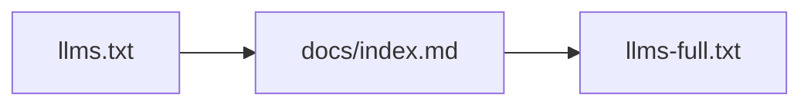

# Agent Usage (alias)

Canonical page: [Agent Usage](/a7-py/docs/guide/agent-usage.md).

Fetch `llms.txt` first, then `docs/index.md` for the document tree, then `llms-full.txt` only when one combined context file is easier than many small fetches.
