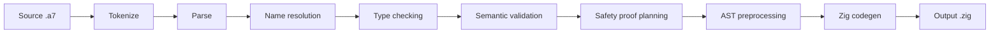

# Compiler Internals

The A7 compiler is a single Python package, `a7/`, structured as a pipeline
of independent stages. There is no runtime. Every stage runs ahead of time
and the final output is Zig source for the host toolchain to build.

## Module layout

```text
a7/
├── cli.py                 argparse entrypoint → A7Compiler
├── compile.py             A7Compiler — orchestrates the pipeline
├── tokens.py              tokenizer / lexer
├── parser.py              recursive-descent parser with precedence climbing
├── ast_nodes.py           AST node definitions
├── ast_preprocessor.py    sub-passes for stdlib resolution, normalization,
│                          mutation analysis, hoisting, constant folding
├── passes/
│   ├── name_resolution.py
│   ├── type_checker.py
│   └── semantic_validator.py
├── safety.py              internal safety proof planning
├── semantic_context.py    shared state across passes
├── symbol_table.py        symbol resolution
├── types.py               type machinery
├── generics.py            generic specialization
├── module_resolver.py     import resolution
├── stdlib/                virtual std/* modules
├── backends/              backend registry + zig.py
├── formatters/            console / JSON / markdown output
└── errors.py              typed errors and rich display
```

## Pipeline



See [Pipeline](/a7-py/compiler/pipeline) for the per-stage detail.

## Iterative-traversal invariant

Semantic passes, AST preprocessing, formatter/reporting walks, and the
backend's binary-expression emission paths use explicit stacks rather
than recursion. The parser is the one exception — it is recursive descent
and depth-bounded by source nesting.

The supported pipeline runs at Python recursion limit `100` in CI to
catch any deep-recursion regressions. The test
`test/test_iterative_traversal.py` is the gate. Don't reintroduce
recursion in compiler internals — A7 source recursion is a separate
banned construct.

## State flow

`SemanticContext` (in `a7/semantic_context.py`) is the shared state
threaded through the semantic passes. After a clean run it carries:

- Resolved symbol table (`a7/symbol_table.py`)
- Concrete and generic type bindings (`a7/types.py`, `a7/generics.py`)
- Safety obligations and proofs (`a7/safety.py`)
- Source spans for every node, for diagnostic display

The backend (`a7/backends/zig.py`) reads this context to emit valid Zig.

## Diagnostics

`a7/errors.py` defines a typed error hierarchy:

| Class | Kind | Exit code |
|---|---|---|
| `TokenizeError` | lex | 4 |
| `ParseError` | syntactic | 5 |
| `SemanticError` | name / type / safety | 6 |
| `CodegenError` | backend | 7 |
| `InternalError` | bug | 8 |

Every error carries a source span. The formatter (`a7/formatters/`) maps
the span to source lines and renders the offending region. JSON output
preserves the same shape.

## Adding a stage

Stages are functions over `SemanticContext`. To add a new pass:

1. Implement it under `a7/passes/<name>.py` using explicit-stack
   traversal (not recursion).
2. Register it in `a7/compile.py:A7Compiler.run` between the existing
   passes.
3. Add a test under `test/test_<name>.py`.
4. Run the iterative-traversal guard:
   `PYTHONPATH=. uv run pytest test/test_iterative_traversal.py`.

## Adding a backend

The Zig backend is the only public one today. To add another:

1. Implement `a7/backends/<name>.py` against the `BaseBackend` interface
   in `a7/backends/base.py`.
2. Register in `a7/backends/__init__.py`.
3. Map stdlib modules in `a7/stdlib/*` to the new backend's runtime.
4. Add fixtures under `test/test_codegen_<name>.py`.

The Zig backend currently handles the entire example suite. New backends
should target compatibility with the same examples (and the same golden
outputs) before being shipped.
