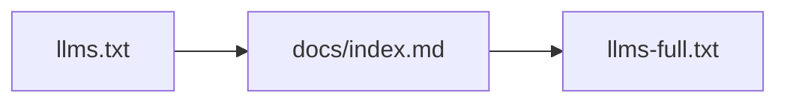

# Agent Usage

## Fetch Order



For curl.md or other agent fetch workflows, start with:

```text
https://code5717.github.io/a7-py/llms.txt
https://code5717.github.io/a7-py/docs/index.md
https://code5717.github.io/a7-py/llms-full.txt
```

Use `llms.txt` for routing, `docs/index.md` for the navigation tree, and `llms-full.txt` when a single combined context file is more useful than many small fetches.

## Local Source of Truth

- `README.md`: user-facing overview and commands.
- `docs/SPEC.md`: language specification.
- `MISSING_FEATURES.md`: current gaps.
- `TODO.md`: tracked implementation backlog.
- `RELEASE.md`: release workflow and artifact gates.
- `AGENTS.md`: repo workflow for coding agents.

## Preferred Commands

```bash
uv sync
uv run a7 examples/001_hello.a7
PYTHONPATH=. uv run pytest --tb=no -q
uv run python scripts/verify_examples_e2e.py
./run_all_tests.sh
```

## Rules For Generated Changes

- Do not write recursive A7 examples or tests.
- Keep `llms.txt`, `llms-full.txt`, and `site/public/docs/` aligned when public docs change.
- Update `CHANGELOG.md`, `README.md`, `docs/SPEC.md`, `MISSING_FEATURES.md`, and `TODO.md` when language behavior changes.
- Treat tests as evidence, not a substitute for reading the code and current hosted workflow state.

## Trust Boundaries

A7 is not a sandbox. Do not compile and run untrusted A7 source on a sensitive host.
