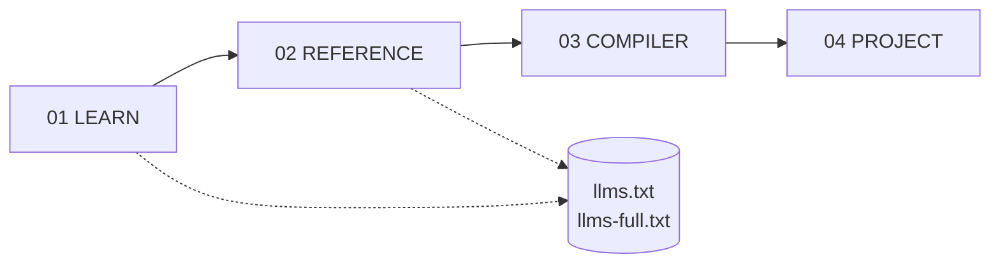

# A7 Documentation

A7 is a small, safe ahead-of-time compiler. It lowers `.a7` source to Zig
source, then to a native binary via the host Zig 0.16 toolchain. The compiler
is written in Python; there is no runtime.

This site is the canonical reference. Every page is also served as raw
markdown — replace `/path` with `/docs/<source>.md` to fetch it from a
terminal or agent.

## Sections

- **[Learn](/a7-py/learn/start)** — get the compiler running, read why it
  exists, and walk through real examples.
- **[Reference](/a7-py/ref/language)** — language, CLI, Python API, and the
  standard library — the surface area in one place.
- **[Compiler](/a7-py/compiler/internals)** — pipeline, safety proofs,
  testing, status, and release process.
- **[Project](/a7-py/project/contributing)** — how to contribute, deploy the
  site, and read the changelog.

## Agent-facing surfaces

Agents and curl-driven tooling should fetch one of:

- `/a7-py/llms.txt` — compact index, one bullet per page.
- `/a7-py/llms-full.txt` — every page concatenated with section headers and
  source URLs. Single fetch for full context.
- `/a7-py/docs/<slug>.md` — raw markdown for any specific page.

Both `.txt` files are auto-generated from the markdown corpus at build time.
They do not drift.

## Invariants

Three facts that shape every page on this site:

1. **A7 source recursion is rejected at compile time.** Direct, mutual, and
   function-pointer alias cycles all error out. Use loops, worklists, or
   explicit stacks. Iteration is the supported control structure.
2. **Compiler internals use iterative traversal.** Semantic passes,
   formatters, and most backend emission paths use explicit stacks. CI
   enforces Python recursion limit 100.
3. **A7 is not a sandbox.** The compiler emits Zig that the host toolchain
   builds and runs. Only compile source you trust.
