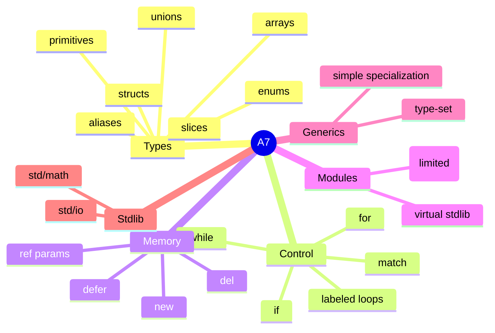

# Language and Library

## Overview

A7 is a statically typed systems language with type inference, manual memory operations, modules, generics, and Zig backends.



The interactive Language page is the Zig-style one-page reference: use browser
find on the page for syntax, types, control flow, memory, modules, stdlib, and
current implementation notes.

For a compact learn-by-reading path, open
[`examples/037_language_tour.a7`](https://github.com/code5717/a7-py/blob/master/examples/037_language_tour.a7).
It is a single commented program verified through Zig.

## Recursion Rule

Source recursion is banned. Direct, mutual, local function-pointer alias, and higher-order callback trampoline recursion are rejected during semantic validation. Repeated work should be expressed with loops, explicit stacks, queues, or index-based worklists.

The compiler uses explicit stacks for semantic analysis, AST preprocessing,
formatter/reporting walks, and backend binary-expression emission. The parser
remains recursive descent, and backend statement/non-binary expression codegen
still has visitor-style recursive emission in some paths. The current pipeline
is regression-tested at Python recursion limit 100 for representative programs.

## Integer Type Guidance

- Use `usize` for sizes, lengths, capacities, allocation byte counts, and array/slice/string indices.
- Use `isize` for signed pointer-sized offsets or differences between positions.
- Use fixed-width integers such as `i32`, `i64`, `u32`, or `u64` when the data itself has a fixed width or range.
- Small arithmetic examples can use `i32`; indexes and counters should usually use `usize`.

## Fixed Arrays

Fixed arrays use `[N]T`. Same-length numeric fixed arrays with the same element
type support element-wise `+` assignment:

```a7
a: [4]f64 = [1.0, 2.0, 3.0, 4.0]
b: [4]f64 = [5.0, 6.0, 7.0, 8.0]
c: [4]f64
c = a + b
```

## Match Fallthrough

`fall` continues from one match case body into the next case body. It is
supported in the Zig backend only when it is the final direct statement
of a non-final match case. `fall` is rejected outside match cases, inside
`else`, inside nested control flow, or in the final case.

## Unions

Untagged union literals use `Type{field: value}` with exactly one named field.
The field must exist on the union and the value must match the field type.
Field access resolves declared union fields in the Zig backend.

Tagged/discriminated union tag workflows are not implemented yet.

## Standard Library

Current virtual stdlib support is intentionally small:

- `std/io`: `io.println`, `io.print`, `io.eprintln`
- `std/math`: `sqrt`, `abs`, `floor`, `ceil`, `sin`, `cos`, `tan`, `log`, `exp`, `min`, `max` with `f32` and `f64` typed variants

These modules are virtual built-ins registered through the module resolver, so
local aliases such as `console :: import "std/io"` and
`mathlib :: import "std/math"` lower the same way as `io` and `math`.

File-backed local imports can be resolved during semantic validation, but
Zig backend lowering and linking for multiple `.a7` files is not implemented
yet. Compile, pipeline, and doc modes reject file-backed imports before codegen
instead of emitting unresolved target code.

Selected import metadata parses and serializes, but selected imports do not
currently introduce direct unqualified names for backend-runnable code.
`using import` remains planned syntax, not a current parser form.

Source stubs such as `mem` and `string` exist in the repository but are not registered public stdlib modules yet.

## Current Syntax Limits

- `@type_set(...)` is implemented for generic constraints. Other `@...`
  intrinsic spellings such as `@size_of`, `@align_of`, `@type_id`,
  `@type_name`, `@unreachable`, `@likely`, and `@unlikely` are reserved or
  tokenized but not semantically resolved/lowered yet.
- Variadic parameter declarations are parsed and partially type-checked, but
  runtime iteration and backend ABI lowering are not implemented. Codegen modes
  reject them before target emission.
- Multiple return values / destructuring declarations are planned syntax, not
  current parser support.
- Simple generic functions, type-set constraints, and used generic struct
  instances lower in Zig. Broader composite generic propagation is a
  known gap.

## Specification

The full language specification lives in [`docs/SPEC.md`](https://github.com/code5717/a7-py/blob/master/docs/SPEC.md).
