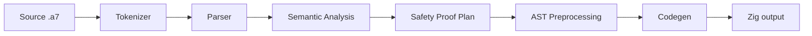

# Pipeline

Canonical page: [Compiler and Tests](/a7-py/docs/compiler.md).



```text
Source (.a7) -> Tokenizer -> Parser -> Semantic Analysis -> AST Preprocessing -> Backend Codegen -> Zig output
```

Use this alias when an agent guesses `/docs/pipeline.md`. The full compiler notes live in `compiler.md`.
